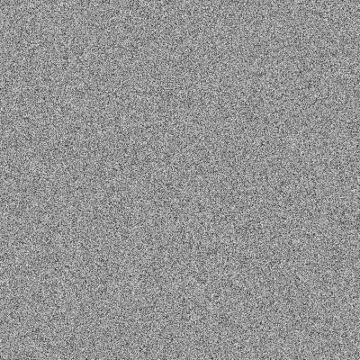

# PNM
### PNM is a collection of open image formats. This library supports ppm, pgm and pbm formats, also had a encoder and decoder implementations.

* usage
```go
"math/rand"
"os"
"testing"

"github.com/jcbritobr/pnm"
    
func main() {
    image := pnm.NewPGMImage(800, 800, 255, pnm.PGMBinary)
    file, err := os.Create("testdata/sinimage.pgm")
    if err != nil {
        t.Errorf("fail with %v", err)
    }
    encoder := pnm.NewEncoder(file)

    imgbuf := image.Buffer()

    for i := range image.Buffer() {
        data := rand.Intn(255-0) + 0
        imgbuf[i] = byte(data)
    }

    err = encoder.Encode(image)
    if err != nil {
        t.Errorf("fail to encode image %v", err)
    }
}
```


